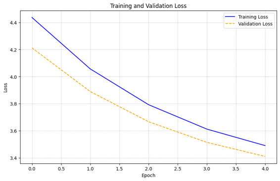

# ABDOMINAL TRAUMA CLASSIFICATION AND SEVERITY PREDICTION
GROUP 5 MEMBERS:

1. CATHERINE GAKII 
2. JOY KAMAU
3. WILFRED NJAGI
4. BRENDA KINYA
5. JOYCE MUTHIKE
6. LEE KIMAITA
7. DANIEL NDIRANGU

### Table of contents 
 - [Business Understanding](#Business-Understanding)
 - [Problem Statement](Problem-statement)
 - [Data Understanding](#Data-Understanding)
 - [Modelling](#Modelling)
 - [Results and Conclusion](#Results-and-Conclusion)
 - [Recommendations](#Recommendations)
 
 

# Business Understanding
With more than 5 million deaths caused by traumatic injury each year, it is the largest cause of early-life mortality and a major public health concern worldwide. Among these, blunt abdominal trauma is frequently sustained in car accidents and can cause serious internal bleeding and damage. In Kenya, a country of over 50 million people, this challenge is magnified by the severe shortage of healthcare infrastructure—only about 50 CT scanners and 200 trained radiologists are available nationwide. This shortage leads to misdiagnoses, delayed treatments due to average waiting times of several weeks, and a lack of access to vital healthcare services for many Kenyans. Despite government initiatives to invest in new CT scanners and train more radiologists, the need for rapid and accurate diagnosis remains critical. However, it is sometimes difficult and time-consuming for medical personnel to interpret CT scans for abdominal injuries. Therefore, there is an urgent need for automated, accurate, and rapid diagnostic solutions as any delay can be fatal.

# Problem Statement
With more than 5 million deaths caused by traumatic injury each year, it is the largest cause of early-life mortality and a major public health concern worldwide. Among these, blunt abdominal trauma is frequently sustained in car accidents and can cause serious internal bleeding and damage. In Kenya, a country of over 50 million people, this challenge is magnified by the severe shortage of healthcare infrastructure—only about 50 CT scanners and 200 trained radiologists are available nationwide. This shortage leads to misdiagnoses, delayed treatments due to average waiting times of several weeks, and a lack of access to vital healthcare services for many Kenyans. Despite government initiatives to invest in new CT scanners and train more radiologists, the need for rapid and accurate diagnosis remains critical. However, it is sometimes difficult and time-consuming for medical personnel to interpret CT scans for abdominal injuries. Therefore, there is an urgent need for automated, accurate, and rapid diagnostic solutions as any delay can be fatal.

# Data Understanding
**1. labels (image_level_labels.csv) Dataset:**

- Number of Rows: 12,029
- Number of Columns: 4
- Columns:
    - patient_id: Unique identifier of the patient.
    - series_id: An identifier for the series of images associated with each patient..
    - instance_number: Specific image instance number within the series.
    - injury_name: Type of injury detected in the image.
- Data Types: The data types are appropriate with integer types for identifiers and object (string) type for the injury name.
- Unique Values: There are 246 unique patients, 330 unique series, 925 unique instance numbers and **2 unique injury types;  Active_Extravasation and bowel.**
  "***Note:*** *Active extravasation in relation to abdominal trauma is the leakage of blood from a blood vessel in the abdomen into the surrounding tissue leading to organ failure or death."*

**2. train(train.csv) Dataset:**

- Number of Rows: 3,147
- Number of Columns: 15
- Columns:
    - patient_id: Unique identifier of the patient.
    - 'any_injury': It serves as a binary indicator representing the presence or absence of any abdominal injury for each patient. A binary variable like 'any_injury' is often used to simplify complex conditions into a format that machine learning algorithms can process.
    - The other 13 columns represent the health status and injury severity of various organs in the adnomen for each patient, namely; the bowel, extravasation, the kidney, the liver and the spleen. They are recorded as binary variables where 0 indicates the absence of a condition, and 1 indicates the presence of a condition.
- Data Types: All columns are of integer type.
- Unique Values: There are 3,147 unique patients. The injury-related columns have binary values (0 or 1), indicating the absence or presence of a specific injury type.

**3. train_meta (train_series_meta.csv) Dataset:**

- Number of Rows: 4,711
- Number of Columns: 4
- Columns:
    - patient_id: Unique identifier of the patient.
    - series_id: An identifier for the series of images associated with each patient..
    - aortic_hu: A quantitative measure of the aorta's radiodensity in  Hounsfield units(HU) on a CT scan. It is measured on a scale of -1000 to 1000 and normally ranges between 150 and 400 HU depending on the patient's age, sex, and other factors.
    - incomplete_organ: A feature in medical imaging representing the presence of an organ that is not fully formed. It's a binary feature where 0 signifies the absence of an incomplete organ, and 1 signifies the presence of an incomplete organ.
- Data Types: The data types are appropriate with integer and float types.
- Unique Values: There are 3,147 unique patients, 4,711 unique series and the incomplete_organ column has binary values (0 or 1) indicating the absence or presence of an incomplete organ in the imaging.

Columns
movieId: A unique identifier for each movie.
imdbId: The identifier of the movie in the IMDb system.
tmdbId: The identifier of the movie in the TMDB system.

# RESEARCH QUESTIONS

* How effective are AI algorithms in automatically detecting traumatic injuries to internal abdominal organs like the liver, kidneys, spleen, and bowel using CT scans?

* What features and patterns in CT scans are most indicative of different severities of abdominal injuries, and how can they be utilized for automated injury grading?

* What are the appropriate metrics for evaluating the performance of the developed AI algorithms in terms of both machine learning benchmarks and clinical utility?

# Modelling

- Comparatively, the baseline model, although a foundational starting point, lacked the nuanced precision necessary for confident medical decision-making. Model 2, while showing promise in certain aspects, struggled with overfitting issues and faced challenges in accurately classifying specific classes, especially the Spleen class. Model 4, although emphasizing precision, encountered complexities in identifying the Bowel class, resulting in exceedingly low accuracy and precision metrics.
- In contrast, Model 3 not only exhibited stable accuracy and precision across multiple classes but also showcased consistent performance on both the validation and test datasets. Its ability to maintain accuracy while significantly reducing false positives makes it the ideal choice for our abdominal trauma classification task. Moreover, the meticulous hyperparameter tuning, the focus on minimizing false positives, and the use of a pre-trained ResNet50 backbone network with frozen layers contributed to the model's impressive performance.

- **Therefore, based on its balanced accuracy, enhanced precision, and consistent performance across various classes and datasets, Model 3 stands as the optimal choice for our abdominal trauma classification and severity prediction task, providing a reliable and accurate tool for medical professionals in critical diagnosis."**
 
 

     
# Results and Conclusion
* Injury Presence in the presence of Any injury: Our analysis highlighted the prevalence of specific injury in the presence of any abdominal injury. Bowel injury and extravasation injury tend to be more common when any abdominal injury is detected. This can help medical professionals identify common injury combinations for more targeted assessments.
* Severity differences: Liver low severity was prominent with liver high being least reccuring. Understanding these severity patterns will play a crucial pattern in the classification and priority cases for medical treatment.
* Incomplete Organ Instances: The presence of incomplete organs, though relatively rare, was noted. This underscores the importance of developing models that can accurately diagnose injuries even in cases where organ visibility might be compromised due to incomplete imaging data.
* Class Relationships: Our analysis showcased relationships between different injury types, highlighting, for instance, the completeness of organs in cases of bowel and extravasation injuries. Understanding these relationships can guide the model's focus on specific injury types and associated organ statuses.
* Patterns in CT Scans: The scan images revealed subtle differences in hyperdensity, potentially indicating injury severity. These insights suggest the importance of capturing intricate patterns in abdominal trauma, indicating the need for advanced image processing techniques.
* Spleen Injury Complexity: All models encountered challenges in spleen injury classification. Despite improvements, accurately detecting spleen injuries remained a significant hurdle, indicating a need for advanced approaches specific to this class.
* Complexity of Aortic Hounsfield Units (HU): The analysis of Aortic HU distributions provided insights into the variation in CT scan values. Though not used for our modelling in this project, understanding the complexity of these values, including outliers and skewed distributions, is essential for developing algorithms that can accurately interpret these variations, further aiding in injury severity assessment.
* Class Imbalance Impact: Addressing class imbalance significantly improved model performance, ensuring accurate predictions across various organ injuries.
Precision Over Accuracy: Emphasizing precision, especially in a medical context, led to the reduction of false positives, crucial in avoiding unnecessary interventions and treatments.
* Model Complexity: While a more complex architecture like DenseNet121 was employed, careful attention to tuning and understanding the trade-offs between accuracy and false positives played a pivotal role in the model's success.
* Consistency and Reliability: Model 3 emerged as the optimal choice due to its balanced accuracy, enhanced precision, and consistent performance across various classes and datasets. It will provide a reliable tool for medical professionals in critical diagnoses.

# Recommendation
* User Training: Provide training sessions to medical practitioners who will be utilizing the model. Familiarize them with its capabilities, limitations, and interpretation of results for effective and informed decision-making.
* Explainable AI Implementation: Integrating explainable AI techniques into the model to provide transparent insights into the decision-making process. 
* Continuous Evaluation: Establish a framework for continuous evaluation and feedback gathering from the medical practitioners to help identify real-world challenges and opportunities for model enhancement.

